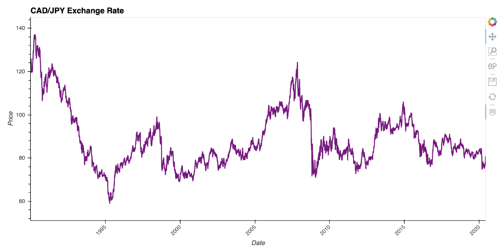
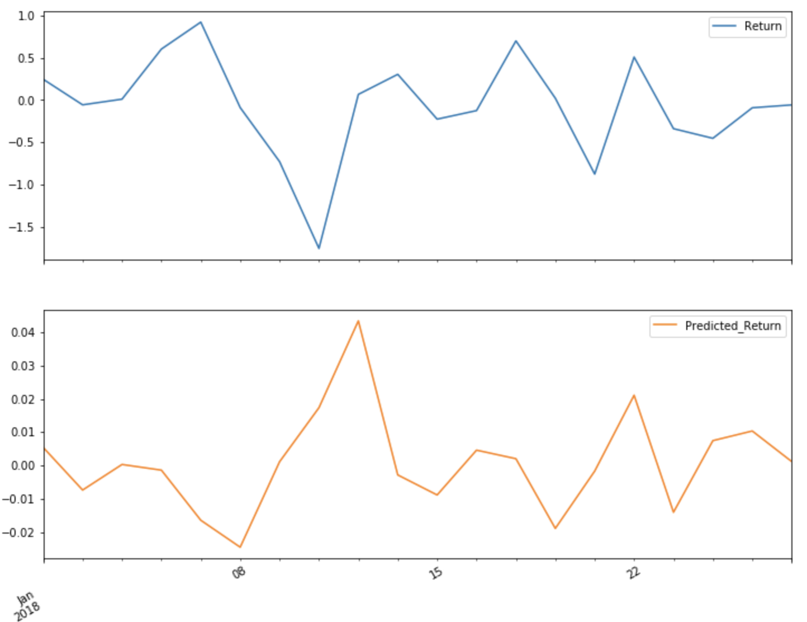

# A Yen For The Future


*This repository contains the Unit 10 Time Series homework assignment, "A Yen for the Future"  in the FinTech bootcamp course at the University of Toronto's School of Continuing Studies.*

---

## Table of Contents

- Project Description
- Installation Requirements
- File Contents

---

## Project Objectives 

The following report uses a combination of time series analysis tools to predict potential future movements in the Canadian (CAD) dollar value verses the Japanese Yen (JPY). 

### Part 1: Time Series Analysis 

Part 1 of the Unit 10 homework assignment conducts a time series analysis based on historical CAD-JPY exchange rate data. The results of the analysis and modelling aims to recongize purchasing trends, volatility, and the effectivesness of the ARMA, ARIMA, and GARCH models as trading strategies. 



### Part 2: Linear Regression Analysis 

The second part of this assignment applies a linear regression analysis model to predict future CAD/JPY returns through the SciKit Learn library. 



### Part 3: Summary of Findings 

The final deliverable summarizes the analysis and findings presented in parts 1 and 2 in the [Summary of Findings](Summary_of_Findings.md)

---

## Installation Requirements

To successfully view parts 1 and 2 of the assignment deliverables; [Time Series Analysis Notebook](Time_Series_Analysis.ipynb) and [Linear Regression Analysis Notebook](Regression_Analysis.ipynb), the following installations are required: 

```
pip install pandas
pip instal numpy
pip install matplotlib
pip install hvplot
pip install -U scikit-learn
pip install statsmodels
```

---

## File Contents

- [Time Series Analysis](Time_Series_Analysis.ipynb)
- [Linear Regression Analysis](Regression_Analysis.ipynb)
- [Summary of Findings](Summary_of_Findings.md)
- [Unit 10 Instructions](Unit10_Instructions.md)

---