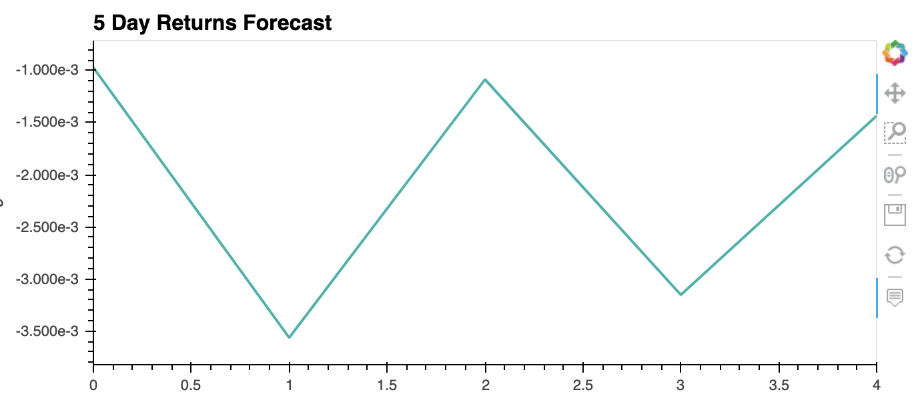
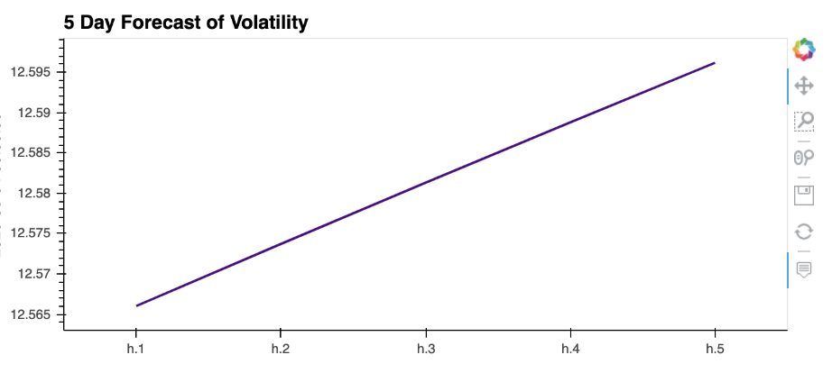
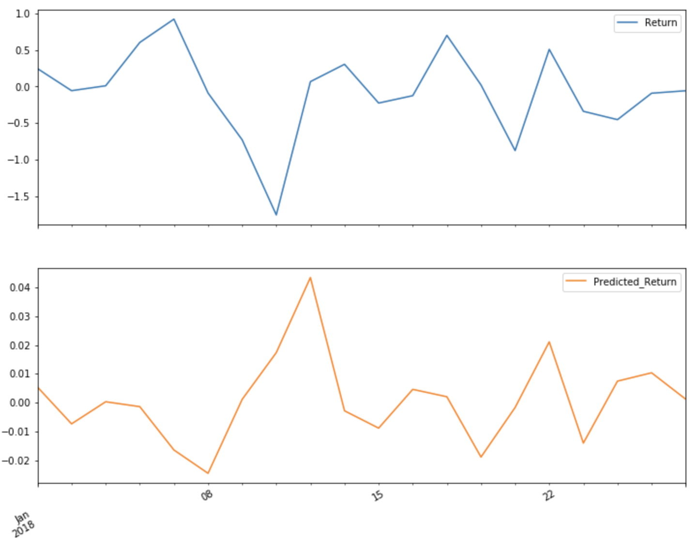

# "A Yen for the Future" Findings Summary 

*This document reports a summary of the analysis and findings conducted in the Time Series Analysis Unit 10 assignment.*

---

## Sections

- [Time Series Analysis Summary](#Time-Series-Analysis)
- [Regression Analysis Summary](#Regression-Analysis)

---

# Time Series Analysis 

## Time Series Forecasting

#### Outlying Trends:

From the CAD/JPY Exchange Rate plot, it is evident that the trend for the Japanese Yen weakens throughout the long term compared to the Canadian Dollar. It can be noticed there is a common short term trend of ups and downs however, there is a slightly more consistent trend indicating a decreasing trend.

### Hodrick-Prescott Filter

Applying the HP Filter aims to decompose the price into two underlying categories; trend and noise. 

#### Price Vs. Trend 

#### Noise 

#### Outlying Trends:

Plotting the trend against the futures returns throughout the given data period, it is evident that there are many short term. A short term up and down pattern may provide a potnetial profitable trading strategy. Observing the price (blue line), there are various occasions it falls below the trend (orange line). Indicating the Japanese Yen is undervalued during these periods, providing a short term buying opportunity for investors recognizing the pattern. 

---

## Returns Forecasting

Returns forecasting uses the CAD and JPY exchange rate to estimate the ARMA and ARIMA models. 

### ARMA 

#### ARMA Model Summary:

#### Model Fit: 

The statistical significance of the p-value in this model suggests the model is not a good fit. The constant *p* = .807 and the autoregressive lag values; *p* < .001 (ar.L1), *p* = .140 (ar.L2) provide strong statistical evidence indicating the the model fails to reject the null hypothesis. Furthermore, despite the first autoregressive lag (ar.L1) *p* < .001, the other two values are above the acceptable threshold (*p* < .05). 

**Sources used to answer this question:**

[P-Value: Statistical Significance](https://www.simplypsychology.org/p-value.html#:~:text=How%20do%20you%20know%20if,%E2%89%A4%200.05)%20is%20statistically%20significant)

#### Model Forecast:

The five day returns forecast plot suggest upcoming volitile returns. It may be significant to mention, the forecast trend mmimics the short term ups and downs trend of the CAD/JPY Exchange Rate plot.

### ARIMA

#### ARIMA Model Summary:

#### Model Fit:

In the ARIMA model, the p-value is statistically nonsignificant. The constant *p* = .458 is greater than the 5% threshold (*p* < .05). Three of the five (ar.L2, ar.L3, & ar.L4) autoregressive lag (P = 5) and the one moving average lag (Q = 1) have *p* > .05 output values. Statistical evidence recommends failing to reject the null hypothesis. Therefore, based on the p-values, this model is not a good fit. 

#### Model Forecast: 

In the ARIMA model, the autoregressor is set to 5 with a differencing factor of 1, and a moving average of 1. From this input, the five day futures price forecast indicates a downward sloping trend in the Japanese Yen. 

---

## Volatility Forecasting

### GARCH

#### Model Fit: 

In the GARCH model and volatility forecast, the p-values are lower than the ones in the ARMA and ARIMA return models above. In this instance, *p* < .05 (except for alpha[2]), thus, indicating a better model performance. 

### Model Forecast:

Based on the five day volatility forecast plot, the CAD/JPY volatility is expected to rise over the presented period. An increase in volatility may suggest an unpredicable price change over the short term.

**Sources used to answer this question:**

[Volatility](https://www.investopedia.com/terms/v/volatility.asp#:~:text=A%20higher%20volatility%20means%20that,time%20period%20in%20either%20direction)

---

## Time Series Analysis Conclusion 

### Purchasing the Yen

**Based on your time series analysis, would you buy the yen now?**

Based on the performance of the models in the time series analysis, investing in the Japanese Yen would not result in an optimized profit purchasing strategy. The ARMA and ARIMA model evaluations indicate the p-value is nonsignificant (*p* > .05). Although, the GARCH model does provide a better statistical outlook on the p-values (*p* < .05), indicating an imporved performance. However, the predicted volatility forecast suggests a steady increase in the given period. This spike in volatility may suggest a fluctuation in prices therefore, not providing investors a solid underlying trend to focus on if choosing to buy the JPY in the present. Additionally, the ARIMA model predicts a decline in the forecasted price of the Yen. Therefore, based on the given factors, purchasing the Yen right now would require further statistical analysis and financial modelling to ensure the outcome is an optimal investment.

### Volatility Forecast

**Is the risk of the yen expected to increase or decrease?**

*Creating an additional volatility forecast model with a greater forecast horizon will assist
in improving the accuracy of this response:*

The JPY volatility forecast is expected to increase throughout a fifteen day time period. The increase in volatility may suggest a short term price fluctuation.

### Trading Strategy Reliability

**Based on the model evaluation, would you feel confident in using these models for trading?**

ARMA, ARIMA, and GARCH are solid foundational tools that provide a good model performance evaluation. Given a greater forecast horizon, these three models can yield useful insight in stochastic modelling required for better trading strategies. However, I would not rely solely on these three performance indicators. To imporve a trading strategy a combination of various evaluation models should be considered to ensure an optimal entry and exit point to maximize the return on investment. 

---

# Regression Analysis 

Through the linear regression analysis, the results of the out-of-sample data and in-sample data calculation indicate this model does not provide reliable future predictions for the data provided. 

The root mean squared error for the out-of-sample and in-sample are:

- The Out-of-Sample Root Mean Squared Error (RMSE) is: 0.6445805658569028
- The In-sample Root Mean Squared Error (RMSE) is: 0.841994632894117

In this analysis, the out-of-sample RMSE is lower than the in-sample RMSE by 0.1974. Considering, out-of-sample data is used to evaluate a model's forecasting performance, having a lower value comapred to the in-sample data is a potential indicator of a weaker future performance. Therefore, this model performs better on in-sample data (0.8419), and worse on out-of-sample data (0.6445). 

In conclusion, having an in-sample RMSE that is lower than the out-of-sample RMSE provides a better generalized accuracy on future forecasted data. In this model, the out-of-sample data is underfit therefore, not providing a good depiction of reailty and the noise. A possible explanation for this outcome is that the training data (used to calculate the in-sample RMSE) is larger than the testing data (used to calculate the out-of-sample RMSE). 

**Sources used to answer this question:**

[In-Sample vs Out-of-Sample Forecast](https://ec.europa.eu/eurostat/statistics-explained/index.php/Glossary:In-sample_vs._out-of-sample_forecasts)

[Machine Learning](http://rstudio-pubs-static.s3.amazonaws.com/19258_9116be8952bd4c00bc61e386a1e99150.html)

[In-Sample & Out-of-Sample Fit](https://stats.stackexchange.com/questions/89905/is-it-abnormal-that-out-of-sample-fit-is-better-than-in-sample/89918)

